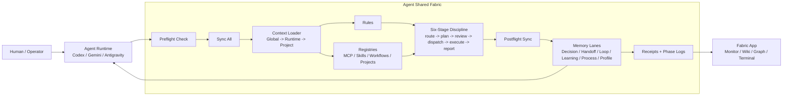
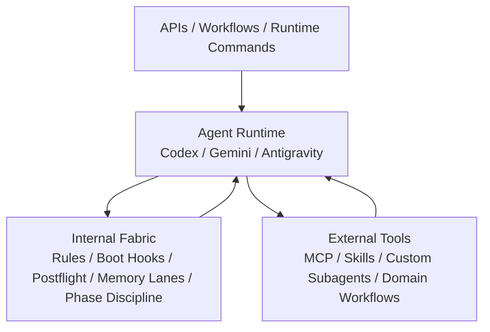
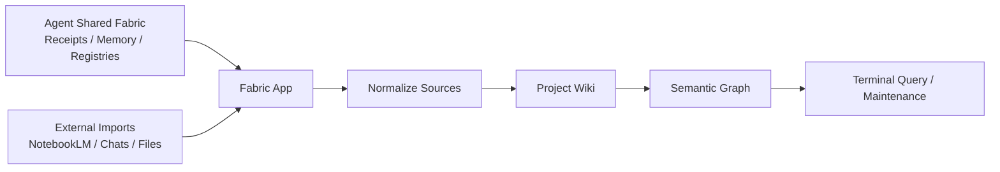

# Agent Shared Fabric

[](https://github.com/Fly-Carrot/agent-shared-fabric/releases)
[](LICENSE)
[](#runtime-contract)
[](#how-it-actually-works)
[](README.zh-CN.md)

**Agent Shared Fabric** turns scattered AI coding agents into a coordinated working system with **shared memory**, **shared tool routing**, **auditable receipts**, and a **repeatable task discipline**.

It gives **Codex**, **Gemini CLI**, **Antigravity**, **Maestro**, **MCP tools**, local skills, and future agent runtimes **one shared operating contract** without forcing them into one monolithic app.

In practical terms, it helps you:

- make **agent memory more durable than chat history**
- keep **handoffs, decisions, open loops, and process learnings** reusable across runtimes
- route tools consistently through **MCP, skills, workflows, and subagents**
- make complex work safer through **preflight, six-stage discipline, and postflight**
- feed downstream knowledge systems such as **Fabric App, Obsidian, wiki indexes, and graph views** with **clean receipts** instead of private runtime guesses

The core idea is simple:

> Agents should share **discipline, memory lanes, tool registries, workflow state, and receipts**. Apps should consume those outputs, **not become the source of truth**.

## Why This Exists

Most agent systems fail in the quiet places:

- every runtime keeps its own private context
- skills and MCP tools drift across machines
- memory is either raw chat history or vague summaries
- complex work skips planning, review, dispatch, and postflight
- dashboards look useful but are not backed by canonical receipts

Agent Shared Fabric treats **coordination itself as infrastructure**.

## Quick Start

Create a local governance root plus a parallel implementation body:

```bash
python3 scripts/init_agent_shared_fabric.py \
  --root ~/AgentSharedFabric/global-agent-fabric \
  --implementation-root ~/AgentSharedFabric/agent-fabric-implementation \
  --workspace /path/to/your/workspace
```

Then boot a runtime through the generated hook:

```bash
WORKSPACE=/path/to/your/workspace \
AGENT_NAME=codex \
~/AgentSharedFabric/global-agent-fabric/hooks/before-task.sh
```

Report `[BOOT_OK]` only after the hook succeeds. See [Quickstart](docs/quickstart.md) for the complete runnable path.

The generated layout is documented in [Root Layout](templates/governance-core/layout/agent-shared-fabric.tree), and a runtime-agnostic startup prompt is available in [Generic Startup Snippet](docs/generic-startup-snippet.md).

## Two Separate Systems

Agent Shared Fabric and Fabric App are deliberately separate.

### Agent Shared Fabric

Agent Shared Fabric is the **agent collaboration governance system**.

It owns:

- boot discipline
- runtime bridge rules
- MCP registry
- skill registry
- workflow registry
- six-stage task protocol
- memory routing
- receipts and sync logs
- project overlays
- postflight write-back
- user-question-profile distillation
- subagent orchestration policy

### Fabric App

Fabric App is the **knowledge-base workstation** that can consume Agent Shared Fabric outputs.

It can read:

- receipts
- phase logs
- memory summaries
- project registries
- source-processing artifacts
- wiki indexes
- semantic graph data

But the app should **not** be the canonical governance brain. It is a **UI, monitor, and knowledge workbench** layered on top.

## Architecture At A Glance



The important direction is **discipline first, then postflight**. A runtime does not simply finish a task and forget it; the **six-stage workflow flows into postflight**, postflight writes **memory lanes**, receipts are generated from durable memory state, and Fabric App can consume those receipts. Memory lanes also feed the next runtime session directly, so **continuation does not depend on the app**.

## Fixed Core vs Custom Extensions

Agent Shared Fabric has **one fixed core** and **many optional extension bodies**.

**Fixed core:**

```text
preflight -> sync_all -> context loading -> six-stage phase logging -> postflight -> memory lanes -> receipts
```

This core should remain **stable across users and runtimes**.

**Strongly recommended integrations:**

- **MemPalace** for process memory and detailed trial-and-error recall.
- **Maestro** for explicit subagent orchestration and human-gated delegation.

**Custom extensions:**

- MCP servers
- skill repositories
- workflow prompts
- custom subagents
- domain registries
- runtime-specific mirrors

Custom extensions are discovered through **registries during preflight/sync-all**. They should **not** be hardcoded into the governance brain. See [Customization Guide](docs/customization-guide.md).

Public templates keep extension examples **disabled by default**. Users enable their own MCP servers, skills, workflows, and subagents only after replacing placeholder commands and environment references.

## The Six Stages

Agent Shared Fabric uses six exact stage keys:

```text
route -> plan -> review -> dispatch -> execute -> report
```

This staged discipline is inspired by the governance pattern in [cft0808/edict](https://github.com/cft0808/edict), especially the idea of separating classification, planning, review, dispatch, execution, and report-back. Agent Shared Fabric is not affiliated with edict and is not a fork; it borrows the operating principle of staged responsibility.

See [Department Routing](docs/department-routing.md) for the runtime meaning of each phase.

## Brain / Body Separation

Agent Shared Fabric separates the fixed internal fabric from external implementation tools.



The internal fabric says **how work is governed**. External tools say **what capabilities are available**. This keeps the framework **portable** while allowing each user to attach their own **MCP servers, skills, workflows, and agents**.

See [Extension Body Model](docs/extension-body-model.md).

## How It Actually Works

Agent Shared Fabric is activated through a hybrid of prompts and hooks.

- **Prompt contract**: model-visible instructions that tell the runtime what root, workspace, phases, and write-back rules to follow.
- **Hook contract**: executable wrappers that enforce boot, phase logging, and postflight.
- **Registry contract**: YAML files that route MCP, skills, workflows, projects, and runtime mirrors.

Recommended loop:

```text
before-task hook -> startup prompt -> phase hook(s) -> after-task hook
```

The generated hooks are:

```text
hooks/before-task.sh
hooks/log-phase.sh
hooks/after-task.sh
```

### Runtime Chain

The chain is deliberately split by responsibility:

| Layer | Responsibility | Examples |
| --- | --- | --- |
| **Prompt** | Makes the operating contract visible to the model | startup snippet, runtime bridge instructions |
| **Hook** | Forces critical lifecycle actions to actually run | before-task, log-phase, after-task |
| **Registry** | Tells the runtime what capabilities exist | MCP servers, skills, workflows, projects |
| **MCP / Skill / Maestro** | Performs specialized work during dispatch | tools, local skills, subagents, orchestration |
| **Memory lanes + receipts** | Preserve continuity across sessions and runtimes | decisions, handoffs, open loops, process memory |

So continuous collaboration is **not only hooks** and **not only skills**. Hooks enforce the lifecycle; skills and MCP provide capabilities; memory lanes and receipts carry state forward.

See [Hooks And Prompts](docs/hooks-and-prompts.md) and [Preflight And Postflight](docs/preflight-postflight.md).

## Memory Model

Agent Shared Fabric does not treat memory as one bucket.

Recommended lanes:

- **Decision**: stable choices and rationale
- **Handoff**: what the next runtime or agent needs
- **Open Loop**: unresolved risks or follow-up work
- **Promoted Learning**: stable reusable learnings
- **Process Memory**: detailed trial-and-error, stored as local process-memory receipts and optionally routed to systems like MemPalace
- **Receipt**: auditable proof that sync/write-back happened
- **User Question Profile**: distilled user patterns, preferences, frictions, and recurring themes

## Runtime Contract

A runtime should not begin substantial work until it has:

1. located the canonical shared fabric root
2. run preflight
3. run sync-all
4. loaded global context
5. loaded runtime-specific context
6. loaded project overlay
7. reported `[BOOT_OK]` only after success

At the end of substantial work it should:

1. write postflight records through canonical scripts or the generated after-task hook
2. include user-question-profile distillation
3. report `[SYNC_OK]` only after success

## Subagent Orchestration

Agent Shared Fabric does not assume one universal subagent engine.

It can route orchestration through:

- native runtime subagents
- Maestro-style orchestration
- MCP tools
- curated/local skills
- scripted fallback

Recommended dispatch order:

```text
MCP first -> curated/local skills -> indexed external skills -> Maestro/native subagents -> manual script
```

For complex work, Maestro or equivalent orchestration can be used as the delegation layer, while human approval remains the execution gate.

## Relationship To Fabric App

Fabric App receives the outputs of Agent Shared Fabric.



In other words:

- Agent Shared Fabric governs agent work.
- Fabric App organizes knowledge-base work.
- The receipt stream is one bridge between them.

## Repository Scope

This public concept repository contains:

- architecture documents
- sanitized templates
- example registries
- runtime bridge patterns
- hook wrappers
- security guidance

It intentionally does **not** contain:

- personal memory records
- private project overlays
- real API keys
- Fabric App source code
- generated app releases
- raw agent conversation history
