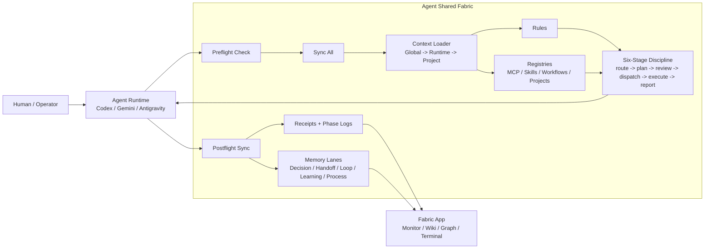
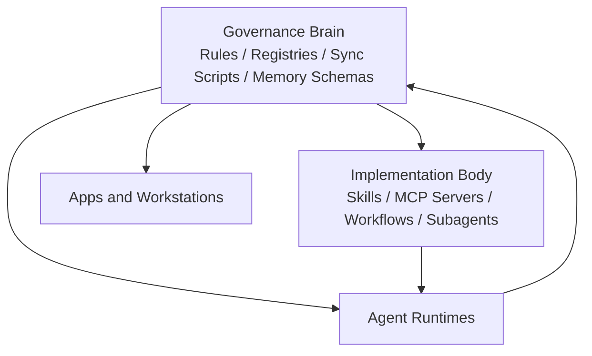
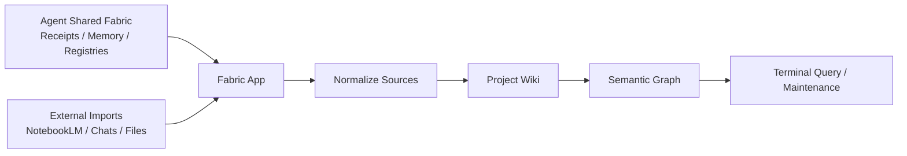

# Agent Shared Fabric

**Agent Shared Fabric** is a governance layer for multi-agent work.

It gives Codex, Gemini CLI, Antigravity, Maestro, MCP tools, local skills, and future agent runtimes one shared operating contract without forcing them into one monolithic app.

The core idea is simple:

> Agents should share discipline, receipts, memory lanes, tool registries, and workflow state. Apps should consume those outputs, not become the source of truth.

## Why This Exists

Most agent systems fail in the quiet places:

- every runtime keeps its own private context
- skills and MCP tools drift across machines
- memory is either raw chat history or vague summaries
- complex work skips planning, review, dispatch, and postflight
- dashboards look useful but are not backed by canonical receipts

Agent Shared Fabric treats coordination itself as infrastructure.

## Quick Start

Create a local governance root plus a parallel implementation body:

```bash
python3 scripts/init_agent_shared_fabric.py \
  --root ~/AgentSharedFabric/global-agent-fabric \
  --implementation-root ~/AgentSharedFabric/agent-fabric-implementation \
  --workspace /path/to/your/workspace
```

Then boot a runtime:

```bash
python3 ~/AgentSharedFabric/global-agent-fabric/scripts/sync/preflight_check.py \
  --global-root ~/AgentSharedFabric/global-agent-fabric \
  --workspace /path/to/your/workspace \
  --agent codex

python3 ~/AgentSharedFabric/global-agent-fabric/scripts/sync/sync_all.py \
  --global-root ~/AgentSharedFabric/global-agent-fabric \
  --workspace /path/to/your/workspace \
  --agent codex
```

Report `[BOOT_OK]` only after both scripts succeed.

See [Quickstart](docs/quickstart.md) for the complete runnable path.

## Two Separate Systems

Agent Shared Fabric and Fabric App are deliberately separate.

### Agent Shared Fabric

Agent Shared Fabric is the **agent collaboration governance system**.

It owns:

- boot discipline
- runtime bridge rules
- MCP registry
- skill registry
- workflow registry
- six-stage task protocol
- memory routing
- receipts and sync logs
- project overlays
- postflight write-back
- user-question-profile distillation
- subagent orchestration policy

### Fabric App

Fabric App is the **knowledge-base workstation** that can consume Agent Shared Fabric outputs.

It can read:

- receipts
- phase logs
- memory summaries
- project registries
- source-processing artifacts
- wiki indexes
- semantic graph data

But the app should not be the canonical governance brain. It is a UI, monitor, and knowledge workbench layered on top.

## Architecture At A Glance



## The Six Stages

Agent Shared Fabric uses six exact stage keys:

```text
route -> plan -> review -> dispatch -> execute -> report
```

These are inspired by staged governance patterns such as 三省六部: separate routing, planning, review, delegation, execution, and final reporting so agents do not silently jump from intention to mutation.

## Brain / Body Separation

Agent Shared Fabric separates **governance brain** from **implementation body**.



The brain stays small, inspectable, and portable. Heavy implementations live in external bodies and are referenced through registries.

See [Extension Body Model](docs/extension-body-model.md).

## How It Actually Works

Agent Shared Fabric can be activated through prompts, hooks, or both.

- **Prompt mode**: paste the generated startup snippet into a runtime session.
- **Hook mode**: run boot scripts before work and postflight scripts after work.
- **Hybrid mode**: use hooks for enforcement and prompts for model-visible discipline.

The full loop is:

```text
preflight_check -> sync_all -> context loading -> phase logs -> postflight_sync
```

See [Hooks And Prompts](docs/hooks-and-prompts.md) and [Preflight And Postflight](docs/preflight-postflight.md).

## Memory Model

Agent Shared Fabric does not treat memory as one bucket.

Recommended lanes:

- **Decision**: stable choices and rationale
- **Handoff**: what the next runtime or agent needs
- **Open Loop**: unresolved risks or follow-up work
- **Promoted Learning**: stable reusable learnings
- **Process Memory**: detailed trial-and-error, often routed to systems like MemPalace
- **Receipt**: auditable proof that sync/write-back happened
- **User Question Profile**: distilled user patterns, preferences, frictions, and recurring themes

## Runtime Contract

A runtime should not begin substantial work until it has:

1. located the canonical shared fabric root
2. run preflight
3. run sync-all
4. loaded global context
5. loaded runtime-specific context
6. loaded project overlay
7. reported `[BOOT_OK]` only after success

At the end of substantial work it should:

1. write postflight records through canonical scripts
2. include user-question-profile distillation
3. report `[SYNC_OK]` only after success

## Subagent Orchestration

Agent Shared Fabric does not assume one universal subagent engine.

It can route orchestration through:

- native runtime subagents
- Maestro-style orchestration
- MCP tools
- curated/local skills
- scripted fallback

Recommended order:

```text
MCP first -> curated/local skills -> indexed external skills -> manual script
```

For complex work, Maestro or equivalent orchestration can be used as the delegation layer, while human approval remains the execution gate.

## Relationship To Fabric App

Fabric App receives the outputs of Agent Shared Fabric.



In other words:

- Agent Shared Fabric governs agent work.
- Fabric App organizes knowledge-base work.
- The receipt stream is one bridge between them.

## Repository Scope

This public concept repository contains:

- architecture documents
- sanitized templates
- example registries
- runtime bridge patterns
- security guidance

It intentionally does **not** contain:

- personal memory records
- private project overlays
- real API keys
- Fabric App source code
- generated app releases
- raw agent conversation history

## Status

This is the architecture-first public extraction of a working local system.

Fabric App is intentionally kept private until the Agent Shared Fabric concept is established clearly on its own.
