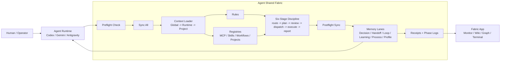
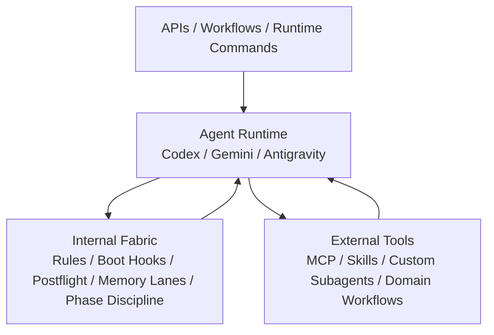

# Agent Shared Fabric

[](https://github.com/Fly-Carrot/agent-shared-fabric/releases)
[](LICENSE)
[](#运行时契约)
[](#实际如何运作)
[](README.md)

**Agent Shared Fabric** 是一个面向多 Agent 协作的治理框架。它把分散的 AI 编程代理变成一个有 **共享记忆**、**共享工具路由**、**可审计 receipts**、**可重复任务纪律** 的工作系统。

它让 **Codex**、**Gemini CLI**、**Antigravity**、**Maestro**、**MCP 工具**、本地 skills，以及未来的 agent runtime **共享同一套工作契约**，而不需要被塞进一个巨大的单体应用里。

它实际解决的问题是：

- 让 **Agent 的记忆不再只停留在聊天记录里**，而是沉淀为可复用的 memory lanes。
- 让 **decisions、handoffs、open loops、process learnings** 可以跨 runtime 延续。
- 让 **MCP、skills、workflows、subagents** 的调用顺序有统一纪律。
- 用 **preflight、six-stage discipline、postflight** 让复杂任务更安全、更可追踪。
- 让 **Fabric App、Obsidian、wiki indexes、graph views** 等下游知识系统消费 **干净的 receipts**，而不是读取某个 runtime 的私有猜测。

核心原则很简单：

> Agent 应该共享 **纪律、memory lanes、工具注册表、workflow 状态和 receipts**。App 应该消费这些输出，而 **不是成为治理源头**。

## 快速开始

初始化一个固定治理内核和一个并列的外挂实现层：

```bash
python3 scripts/init_agent_shared_fabric.py \
  --root ~/AgentSharedFabric/global-agent-fabric \
  --implementation-root ~/AgentSharedFabric/agent-fabric-implementation \
  --workspace /path/to/your/workspace
```

生成结构：

```text
AgentSharedFabric/
  global-agent-fabric/              # 固定治理内核
  agent-fabric-implementation/      # 用户外挂能力区
```

启动 runtime：

```bash
WORKSPACE=/path/to/your/workspace \
AGENT_NAME=codex \
~/AgentSharedFabric/global-agent-fabric/hooks/before-task.sh
```

只有 hook 真实成功后，Agent 才能报告：

```text
[BOOT_OK]
```

## 两个系统，不要混在一起

### Agent Shared Fabric

Agent Shared Fabric 是 **Agent 协同治理系统**。它负责：

- boot discipline
- runtime bridge rules
- MCP registry
- skill registry
- workflow registry
- six-stage task protocol
- memory routing
- receipts and sync logs
- project overlays
- postflight write-back
- user-question-profile distillation
- subagent orchestration policy

### Fabric App

Fabric App 是 **知识库工作台**。它可以消费 Agent Shared Fabric 的输出，例如：

- receipts
- phase logs
- memory summaries
- project registries
- source-processing artifacts
- wiki indexes
- semantic graph data

但 Fabric App **不应该成为 canonical governance brain**。它是 **UI、monitor 和 knowledge workstation**，不是治理源头。

## 总体架构



关键方向是：**六阶段纪律先进入 postflight**，postflight 写入 **memory lanes**，memory lanes 生成 **receipts** 给 Fabric App 消费，同时 memory lanes 也回流给下一轮 Agent Runtime。

## 固定内核 vs 用户外挂

固定内核：

```text
preflight -> sync_all -> context loading -> six-stage phase logging -> postflight -> memory lanes -> receipts
```

这个部分应该 **跨用户、跨 runtime 保持稳定**。

强烈推荐但不强制：

- **MemPalace**：用于 process memory 和复杂 trial-and-error recall。
- **Maestro**：用于明确的 subagent orchestration 和 human-gated delegation。

用户可自定义：

- MCP servers
- skill repositories
- workflow prompts
- custom subagents
- domain registries
- runtime-specific mirrors

这些外挂能力通过 **registry 在 preflight/sync-all 阶段被发现**，不应该硬编码进治理内核。

## 六阶段纪律

Agent Shared Fabric 使用六个固定 phase key：

```text
route -> plan -> review -> dispatch -> execute -> report
```

这个分阶段纪律受到 [cft0808/edict](https://github.com/cft0808/edict) 的治理模式启发，尤其是将任务分类、规划、审核、派发、执行、回奏拆开的思想。Agent Shared Fabric 与 edict 没有官方关联，也不是 fork。

## Brain / Body Separation



Internal Fabric 规定 **“工作如何被治理”**；External Tools 提供 **“有哪些能力可以调用”**。这样框架保持可迁移，而每个用户仍可以接入自己的 **MCP、skills、workflows 和 agents**。

## 实际如何运作

推荐链条：

```text
before-task hook -> startup prompt -> phase hook(s) -> after-task hook
```

生成的 hooks：

```text
hooks/before-task.sh
hooks/log-phase.sh
hooks/after-task.sh
```

### 运行链条分工

这套链条不是只靠 hook，也不是只靠 skill。它按职责分层：

| 层级 | 负责什么 | 例子 |
| --- | --- | --- |
| **Prompt** | 让模型看见工作契约 | startup snippet、runtime bridge instructions |
| **Hook** | 强制关键生命周期动作真的运行 | before-task、log-phase、after-task |
| **Registry** | 告诉 runtime 有哪些能力可用 | MCP servers、skills、workflows、projects |
| **MCP / Skill / Maestro** | 在 dispatch 阶段执行专业能力 | tools、本地 skills、subagents、orchestration |
| **Memory lanes + receipts** | 跨 session、跨 runtime 保持连续性 | decisions、handoffs、open loops、process memory |

所以连续协作的核心是：**hook 负责执行纪律，skill/MCP 负责专业能力，memory lanes 和 receipts 负责把状态传给下一轮 Agent**。

任务结束后必须通过 **postflight** 写回：

```text
memory lanes -> receipts -> downstream apps
memory lanes -> next agent runtime
```

只有 postflight 成功后才能报告：

```text
[SYNC_OK]
```

## 参考文档

- [Quickstart](docs/quickstart.md)
- [Generic Startup Snippet](docs/generic-startup-snippet.md)
- [Department Routing](docs/department-routing.md)
- [Customization Guide](docs/customization-guide.md)
- [Root Layout](templates/layout/agent-shared-fabric.tree)
