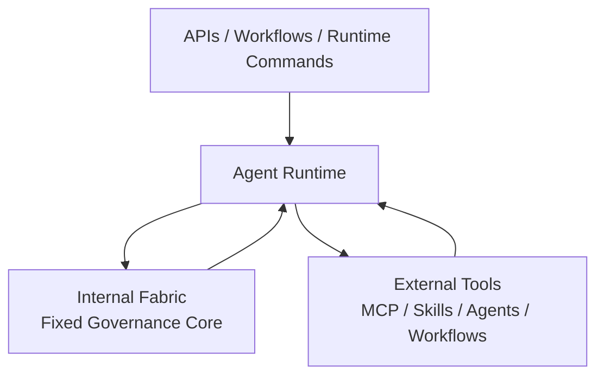

# Extension Body Model

Agent Shared Fabric uses a parallel-folder model: a fixed internal fabric plus customizable external tool bodies.

## Internal Fabric

The governance root contains light, inspectable state:

```text
global-agent-fabric/
  rules/
  hooks/
  mcp/servers.yaml
  skills/sources.yaml
  workflows/sources.yaml
  memory/schema.yaml
  projects/registry.yaml
  sync/
  scripts/sync/
```

It describes how work is governed.

The fixed internal fabric includes:

- preflight
- sync-all
- context loading order
- six-stage phase logging
- postflight
- memory lanes
- receipts
- user-question-profile distillation
- prompt and hook contracts

## External Tools

The implementation body contains heavy executable capability:

```text
agent-fabric-implementation/
  skills/
  mcp/
  workflows/
  agents/
```

It provides what the runtime can do.

External tools can include:

- MCP servers
- local skill repositories
- curated skill bundles
- workflow prompts
- custom subagents
- domain-specific registries

## Runtime Shape



The runtime sits between the fixed fabric and the user's tools. It obeys the fabric and calls tools through registries.

## Recommended Integrations

Two integrations are strongly recommended, but not mandatory:

- **MemPalace**: process memory and deep trial-and-error recall.
- **Maestro**: explicit subagent orchestration with a human approval gate.

Other tools should be added by the user through registries rather than copied into the core framework.

## Registry References

The governance brain points to the body through registries:

- `skills/sources.yaml` points to skill folders
- `mcp/servers.yaml` points to MCP server entrypoints
- `workflows/sources.yaml` points to reusable workflow prompts
- `sync/runtime-map.yaml` points to generated runtime mirrors

This is the plugin model: structure and function are separated, but connected by explicit routes.
